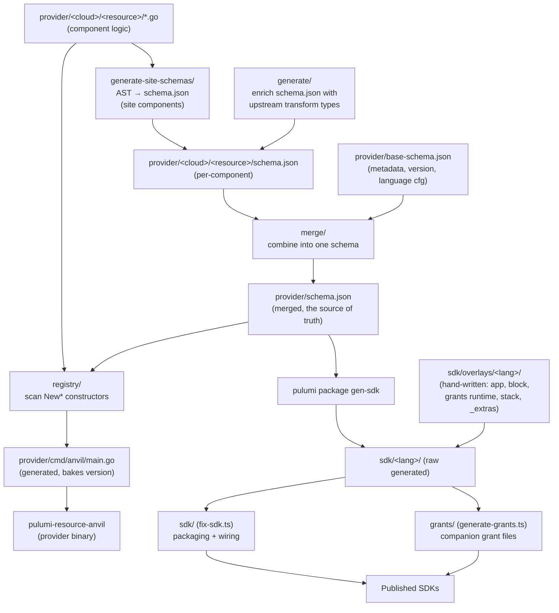

# `scripts/` — the Anvil build pipeline

This folder holds the code-generation and post-processing steps that turn Anvil's
**hand-authored component definitions** into **published SDKs** (TypeScript, Python,
Go) and a **runnable provider binary**.

Nothing in here is run directly by users. Every script is invoked, in order, by
`build.go` at the repo root (`go run build.go <target>`). Think of `scripts/` as
the stages of an assembly line; `build.go` is the conveyor belt.

## Why this exists

Anvil is a Pulumi **component provider**. A component (e.g. `aws/bucket`) is
defined once in Go + a `schema.json`, and from that single definition we need:

- a merged provider schema Pulumi understands,
- a provider binary that registers every component,
- three language SDKs with Anvil's ergonomics layered on top (grants, the `App`
  model, forward references, secure-by-default types).

Pulumi's own `pulumi package gen-sdk` gets us most of the raw SDK, but not the
Anvil-specific parts. These scripts fill the two gaps: **producing the schema
Pulumi reads**, and **post-processing the SDK Pulumi emits**.

## The guiding principles (read these first)

1. **The schema is the single source of truth.** Anything expressible in the
   schema lives there, so `gen-sdk` emits it natively for all languages. We do
   **not** patch types/enums/metadata into generated files when the schema can
   carry them.
2. **Generated files are never hand-edited.** Hand-written code lives in
   `sdk/overlays/<lang>/` and is copied in *after* `gen-sdk`. Additions to
   generated classes (grant methods) use **companion files** (TS declaration
   merging / Python monkeypatch), never in-place splicing.
3. **The version is set in one place** — `provider/base-schema.json`'s `version`.
   `build.go` reads it once and threads it everywhere (provider binary, registry,
   SDK packages). See [`registry/`](registry/README.md) and [`sdk/`](sdk/README.md).

## The pipeline



Plain-language ordering (matches `build.go`):

```
1. generate-site-schemas   AST(Go structs)      → per-component schema.json   (site components)
2. generate                schema.json + upstream→ per-component schema.json   (enriched in place)
3. merge                   base-schema + all     → provider/schema.json
4. registry                provider/*/*.go       → provider/cmd/anvil/main.go  (+ bake version)
5. pulumi package gen-sdk  provider/schema.json  → sdk/<lang>/                 (raw)
6. copyDir overlay         sdk/overlays/<lang>/  → sdk/<lang>/                 (hand-written in)
7. sdk (fix-sdk.ts)        sdk/<lang>/           → sdk/<lang>/                 (packaging + wiring)
8. grants (generate-grants)configs/*             → sdk/<lang>/aws/*.grants.*   (companion methods)
```

Steps 1–3 build the schema. Step 4 builds the provider. Steps 5–8 build the SDKs.

## Folder map

| Folder | Language | Stage | Produces | Docs |
|---|---|---|---|---|
| [`generate-site-schemas/`](generate-site-schemas/README.md) | Go | 1 | per-component `schema.json` from Go structs (site components) | ↳ |
| [`generate/`](generate/README.md) | Go | 2 | enriched per-component `schema.json` (upstream transform types) | ↳ |
| [`merge/`](merge/README.md) | Go | 3 | `provider/schema.json` (single merged schema) | ↳ |
| [`registry/`](registry/README.md) | Go | 4 | `provider/cmd/anvil/main.go` (component registration + version) | ↳ |
| [`sdk/`](sdk/README.md) | TS (ts-node) | 7 | packaging + overlay wiring in the generated SDKs | ↳ |
| [`grants/`](grants/README.md) | TS (ts-node) | 8 | `*.grants.ts` / `*_grants.py` companion files | ↳ |

(Step 5 is Pulumi's CLI; step 6 is a `copyDir` in `build.go`. Neither lives in
`scripts/`.)

## Running it

```bash
go run build.go build          # full build: everything above
go run build.go generate       # stage 1+2 (per-component schemas)
go run build.go merge          # stage 1–3 (→ provider/schema.json)
go run build.go registry       # stage 1–4 (→ main.go)
go run build.go build-sdk      # nodejs SDK end to end
go run build.go build-python-sdk
go run build.go gen-go-sdk
```

Each stage depends on the earlier ones, so e.g. `merge` re-runs `generate` first.

## Housekeeping note

`scripts/merge/schema.json` is a stale sample left over from an old PR and is
**not used** by anything — safe to delete.
